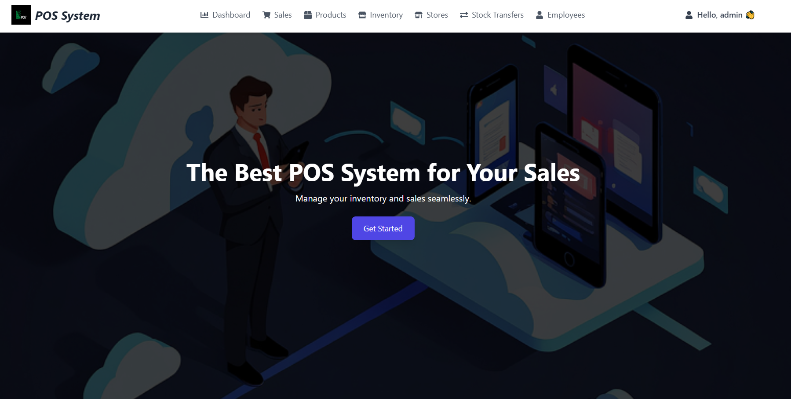
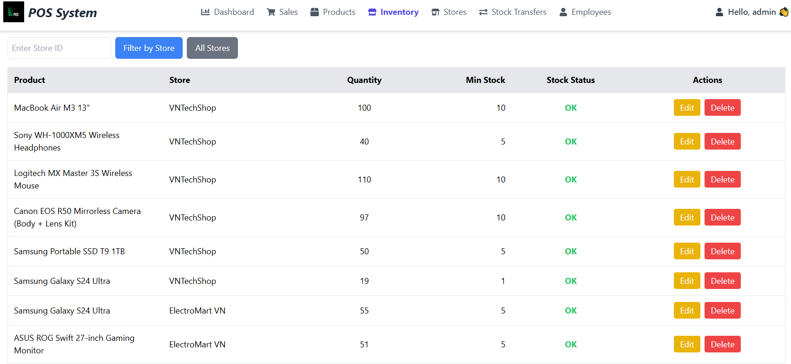
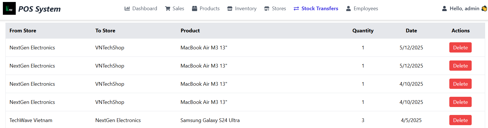
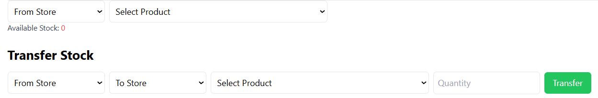
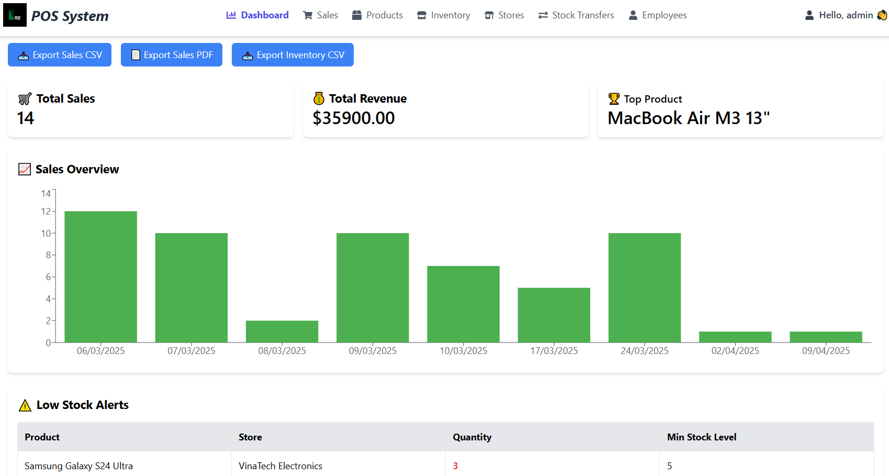
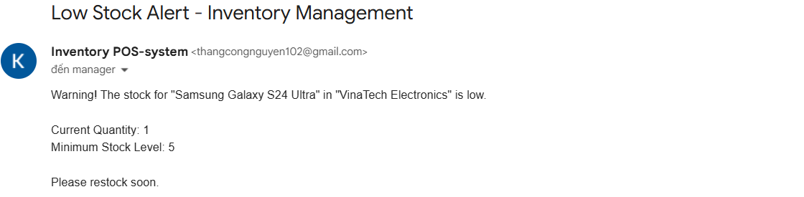
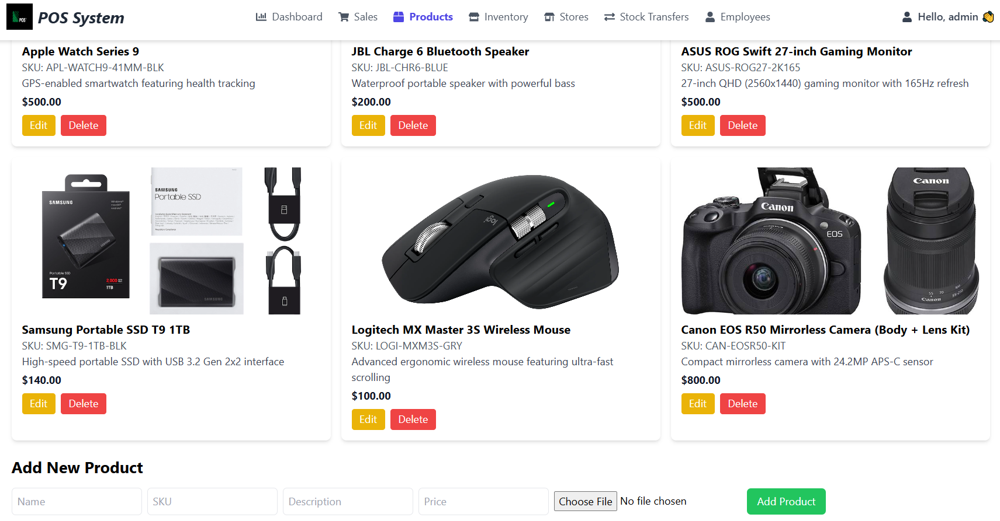
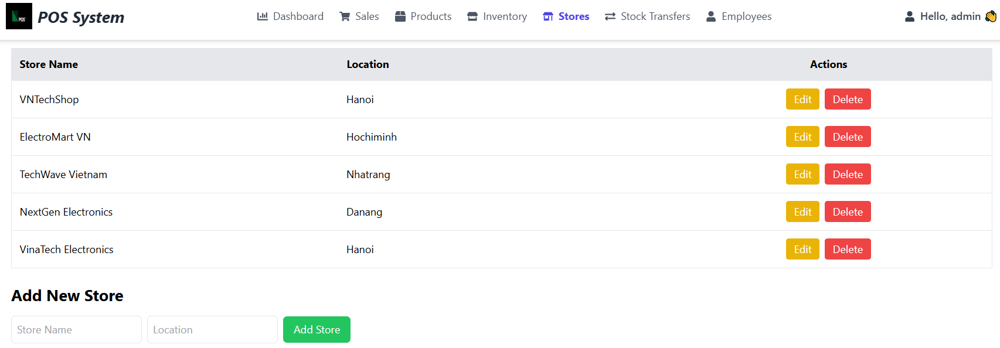
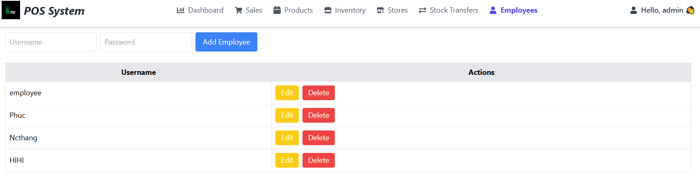

# 🛍️ POS Inventory Management Module (Full-stack Web Application) (POS IM)



## 🌟 Project Overview

This is a **Full-Stack JavaScript** graduation project focused on developing a high-performance **Inventory Management Module** for Point-of-Sale (POS) systems. The module was designed to eliminate the inefficiencies of manual inventory tracking, such as data errors, delayed updates, and the lack of real-time visibility across multiple store locations.

**Key Achievements:**
* **Automated Stock Management:** Real-time inventory updates upon sales and transfers.
* **Multi-Store Support:** Centralized management and seamless item transfers between different locations.
* **Proactive Alerting:** Implemented an automated notification system for low stock levels (via email and dashboard alerts).

---

## 📈 Performance & Business Impact

The developed module significantly **boosted operational efficiency** across core retail processes. The metrics below highlight the time savings achieved upon implementation:

| Business Action | Average Manual Time (min) | Average POS IM Time (min) | Efficiency Improvement |
| :--- | :--- | :--- | :--- |
| **Adding a New Product** | 3.0 | 0.5 | **83%** |
| **Searching for Product Info** | 2.5 | 0.2 | **92%** |
| **Generating Inventory Report** | 5.0 | 0.3 | **94%** |
| **Low-Stock Notification** | Not Available | Instantaneous (Email + UI) | **100%** |
| **...** |  |  |  |

---

## ✨ Core Features Showcase
The POS IM module is engineered to handle complex retail operations, providing administrators and operators with a powerful, real-time control panel.

### 1\. Centralized Multi-Store Inventory Management

The system enables precise tracking of stock levels across **multiple store locations** and facilitates immediate inventory reconciliation during transfers, significantly reducing logistical bottlenecks and out-of-stock situations.

  * **Key Function:** View real-time stock levels for a specific product across all affiliated stores.



### 2\. Streamlined Product Transfer Interface

This feature automates the process of transferring goods between two specific stores, ensuring data integrity (ACID compliance) during the transaction and instantly updating stock records in the central MySQL database.

  * **Key Function:** Select source/destination stores and quantity to execute a validated internal transfer.





### 3\. Automated Low Stock Alerting System

The module proactively monitors all product inventory levels. When stock for an item falls below its predefined threshold, the system immediately notifies the administrator through two channels.

  * **Channels:** Dashboard UI notification and automated **Email notification**.




### 4\. Sales Transaction Recording and History

Beyond inventory management, the module logs all successful sales transactions, allowing for accurate debits from the inventory and providing a comprehensive sales history view for auditing.

  * **Key Function:** View detailed records of sales, including the time, items sold, and the affected store.


### 5\. Product Catalog Management (CRUD Operations)

This core function provides a seamless interface for managing the entire product lifecycle—from creation to retirement. It ensures data integrity by validating product uniqueness via the SKU upon creation.

  * **Key Functions:** Adding new products, editing attributes (Name, Price, Category), and searching/filtering the catalog.



### 6\. Administrative Control Panels (Store and User Management)

The module includes high-level administrative tools, demonstrating the application's **role-based authorization (Admin)**. This includes dedicated interfaces for managing physical store locations and authorized system users.

* **Store Management**

* **User Management**


## 🛠️ Technology Stack

The project is built on a **RESTful API** architecture using the modern MERN-adjacent stack (Node.js, Express, React, MySQL).

| Component | Technology | Rationale |
| :--- | :--- | :--- |
| **Backend / API** | **Node.js** + **Express.js** | Fast, scalable runtime and minimalist framework for building APIs. |
| **Frontend / UI** | **React.js** | Component-based, Single-Page Application (SPA) architecture for a dynamic user experience. |
| **Database (DBMS)** | **MySQL** | Chosen for its reliability, transaction support (ACID compliance), and suitability for complex relational inventory data. |
| **Authentication** | **JWT (JSON Web Tokens)** | Secure and stateless mechanism for user authorization and role-based access control (Admin/Operator). |
| **Testing** | **Jest** & **Supertest** | Used for Unit and Integration testing of the server API logic, achieving **80% code coverage**. |

---

## 🚀 Setup and Installation

Follow these instructions to set up and run the project locally.

### Prerequisites

* **Node.js** (`v18.x` or newer)
* **MySQL Server**
* **Git**

### 1. Database Configuration

1.  Create a new MySQL database (e.g., `pos_inventory_db`).
2.  Run the necessary schema migrations/SQL scripts to create the tables (`Products`, `Stores`, `Inventory`, etc.).

### 2. Backend Setup (Server API)

```bash
# Clone the repository
git clone <YOUR_GITHUB_REPO_URL>
cd pos-inventory-module/server 

# Install dependencies
npm install

# Configure environment variables (create a .env file)
# Example .env:
# DB_HOST=localhost
# DB_USER=<your_mysql_user>
# DB_PASSWORD=<your_mysql_password>
# DB_NAME=pos_inventory_db
# JWT_SECRET=super_secret_key_for_auth
# EMAIL_USER=<notification_email>
# EMAIL_PASS=<email_app_password>

# Start the server
npm start
# or for development
npm run dev
````

### 3\. Frontend Setup (Client UI)

```bash
cd ../client # Assuming your client folder is adjacent to server

# Install dependencies
npm install

# Configure API base URL (create a .env.local file)
# Example .env.local:
# VITE_API_BASE_URL=http://localhost:3000/api

# Start the client application
npm run dev
```

The application should now be accessible at `http://localhost:5173` (or the port specified).

-----

## 👤 Contact

This project was developed as a Final Qualification Work (FQK) at **[Moscow Institute of Electronic Technology]**.

  * **Author:** Nguyen Cong Thang
  * **Email:** `<Thangcongnguyen102@gmail.com>`
  * **[Optional] Project Documentation:** [Technical Specification PDF by russian language -82 pages](https://drive.google.com/file/d/1nN9eOtIuZx2lygl-0smW4W3C9KOVZ2L9/view?usp=sharing)

<!-- end list -->

```
```
